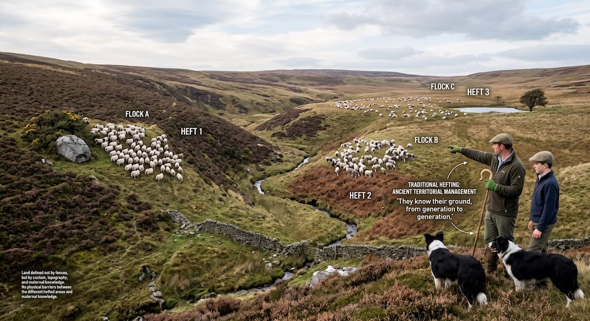

# heft

`heft` helps you work on several tasks at once with Git worktrees and Herdr.
It gives each task a branch, a worktree, and a Herdr workspace, following one
consistent workflow that is easy to use from scripts.

Pass a prompt when you create the worktree and heft will start your agent there.
Your current workspace stays open, so you can move between tasks without
shuffling branches or local changes.



## Requirements

- Git
- Herdr

## Quick start

Install the latest release for the current user:

```sh
curl -fsSL https://raw.githubusercontent.com/pasierb/heft/main/install.sh | sh
```

## Agent skill

Install the heft skill for your coding agent:

```sh
npx skills add pasierb/heft --skill heft --global
```

The skill teaches agents when and how to use heft for task-focused worktrees.

## Usage

Initialize it in a Git repository:

```sh
heft init
```

Commands can run from any worktree or its subdirectories. Heft uses the primary
checkout's `.heft.yaml` and resolves worktree paths relative to that checkout.
Worktree-local configuration is ignored; `init` and `configure` update the primary
checkout's configuration and `.gitignore`.

Create a worktree and Herdr workspace for a task:

```sh
heft work feature/abc
```

Heft fetches `origin`, creates `feature/abc` from the configured base branch,
checks it out at `.worktrees/feature_abc`, and opens a Herdr workspace there.
If the branch already exists locally or on `origin`, heft reuses it.
If its worktree already exists at the configured path, heft reuses it without
changing its files or commits. Each invocation opens a new Herdr workspace and
runs the configured tabs and any supplied prompt.

To bring local setup files into new worktrees, add `.heftcopy` in the primary
checkout:

```text
# Local setup
.heft.yaml
.env
.local/
```

List one checkout-relative file or directory per line. Blank lines and lines
starting with `#` are ignored; surrounding whitespace is trimmed. Paths are
literal, with no globbing or exclusions. Directories copy recursively, including
hidden files, and file permissions are preserved. Files come from the primary
checkout, even when running Heft inside another worktree.

Copying happens before Herdr opens, only for newly created worktrees. Existing
destination files are kept and directories are merged. Missing sources and copy
errors produce warnings without preventing the workspace from opening. Absolute
paths, parent traversal, Git metadata, directories containing the destination,
and symlinks are not supported. Git ignore rules are unchanged: list files in
`.gitignore` separately if they should stay untracked. No files are copied
automatically, and an absent `.heftcopy` changes nothing.

Use `--label` to override the workspace label derived from the configured prefix
and branch name:

```sh
heft work feature/abc --label "ticket 39"
```

List the repository's worktrees:

```sh
heft list
```

Remove a worktree when it has no staged, unstaged, or untracked changes and
all its commits exist on an origin branch:

```sh
heft cleanup feature/abc
```

The local branch is preserved. To remove all eligible linked worktrees while
leaving dirty worktrees, worktrees with unpushed commits, active agent workspaces,
and local branches untouched, run:

```sh
heft prune
```

Pruning from inside a linked worktree includes that worktree when eligible.
The primary checkout is always preserved.

Both commands fetch origin once and refresh its branch references before removal.
A missing or unreachable origin prevents removal. No upstream or same-name remote
branch is required: commits may exist on any origin branch. Squash-merged commits
remain protected if their original commits no longer exist on origin.

Use `heft cleanup <branch> --force` or `heft prune --force` to skip the fetch and
unpushed-commit check, including when offline. Dirty worktrees remain protected,
and forced pruning still preserves active agent workspaces.

## Scriptable workflows

Small project-specific commands can wrap `heft work`. For example, this
repository has a Make target for starting work on a Fizzy card:

```sh
make work-on-fizzy 33
```

The target runs the equivalent of:

```sh
heft work fizzy-33 --prompt="Check the fizzy card id=33, analyze it and prepare solution plan"
```

Heft creates the worktree and workspace, starts the command configured for the
first tab, waits for Herdr to recognize the agent, then sends the prompt. The
command returns once Herdr accepts the prompt. The agent continues working in
its new workspace.

Use `--no-focus` when a script should keep the current workspace focused:

```sh
heft work feature/abc --no-focus
```

## Configuration

`heft init` creates `.heft.yaml` at the Git project root and prompts for each
setting, including a default Claude, Codex, Agy, or custom agent command. Run
`heft configure` later to change the other settings. The harness prompt is
skipped once an agent tab is configured.

```yaml
worktrees_dir: .worktrees
base_branch: main
workspace_prefix: heft
tabs:
  - name: codex
    command: codex --yolo
    agent: true
  - name: shell
profiles:
  research:
    tabs:
      - name: codex
        command: codex --model gpt-5
        agent: true
      - name: notes
        command: nvim
```

- `worktrees_dir` controls where worktrees are stored. The default is
  `.worktrees`; heft also adds the directory to `.gitignore`.
- `base_branch` is the branch used for new worktrees. Setup suggests the branch
  referenced by local `origin/HEAD`. If unavailable, it checks `origin/main`,
  `origin/master`, local `main`, then local `master`, falling back to `main`.
  Detection runs offline, and the prompt lets you override the suggestion.
- `workspace_prefix` prefixes Herdr workspace names. It defaults to the
  repository name, producing names such as `heft feature/abc`.
- `tabs` is an ordered list of Herdr tabs. Each tab needs a `name`; an optional
  `command` runs in its root pane. Mark one command tab with `agent: true` to
  make it the target for `--prompt`.
- `profiles` contains named alternative tab configurations. Select one with
  `heft work <branch> --profile <name>`; without the flag, heft uses `tabs`.

With no `tabs` setting, heft creates one Herdr workspace with its default tab.
New configuration puts the selected agent first so it is focused, followed by
the shell tab. Selecting Codex sets its command to `codex --yolo`, which disables
approval prompts and sandboxing. Reconfiguring preserves existing agent commands
and offers the saved base branch as the default. Choosing `Other` stores the
entered shell command and names the tab after its executable. Any extra tabs open
in the background.

`--prompt` requires a configured tab marked with `agent: true` to start a
Herdr-recognized agent. In the example above, that is `codex`.

## Commands

| Command | Description |
| --- | --- |
| `heft init` | Check for Herdr and create the project configuration |
| `heft configure` | Update the project configuration interactively |
| `heft work <branch>` | Create or reuse a branch, worktree, and Herdr workspace |
| `heft work <branch> --label <text>` | Set a custom Herdr workspace label |
| `heft work <branch> --prompt <text>` | Start and prompt the configured agent tab |
| `heft work <branch> --no-focus` | Keep the current Herdr workspace focused |
| `heft list` | List the repository's worktrees |
| `heft cleanup <branch>` | Close its Herdr workspace and remove a clean worktree with commits on origin |
| `heft prune` | Remove clean linked worktrees with commits on origin and without active agents |
| `heft version` / `heft --version` | Print version information |

Run `heft <command> --help` for command-specific usage.

## Development

Building from source requires Go 1.26 or newer.

```sh
make install # build and install from source
make build   # build bin/heft
make run     # run without installing
make test    # run the test suite
make test-e2e # test installation and every command in Docker with real Herdr
```

`make build` derives the version from Git. Direct `go build` invocations report
`dev` unless a version is supplied with `-ldflags "-X main.version=<version>"`.
